<div id="top"></div>

<!-- PROJECT [jovan-vukic] SHIELDS -->

<!-- PROJECT LOGO -->
<br />
<div align="center">
  <h2 align="center">Secure Gift Shop App</h2>

  <p align="center">
    The project aims to enhance the security of the Christmas Gift Shop application.
    Tasks include utilizing static analysis tools for vulnerability assessment, addressing SQL injection and Cross-site Scripting vulnerabilities,
    implementing protection against Cross-site Request Forgery attacks, establishing some role-based authorization mechanisms,
    and integrating DevOps practices such as exception handling, logging, and auditing.
    Through these measures, the project seeks to fortify the application against potential security threats while promoting best practices in software security and development.
    <br />
    <a href="https://github.com/jovan-vukic/secure-gift-shop-app"><strong>Explore the project »</strong></a>
    <br />
    <br />
    <a href="https://github.com/jovan-vukic/secure-gift-shop-app/issues">Report Bug</a>
    ·
    <a href="https://github.com/jovan-vukic/secure-gift-shop-app/issues">Request Feature</a>
  </p>
</div>

<!-- TABLE OF CONTENTS -->
<details>
  <summary>Table of Contents</summary>
  <ol>
    <li>
      <a href="#about-the-project">About The Project</a>
      <ul>
         <li><a href="#code-static-analysis">Code Static Analysis</a></li>
         <li><a href="#sql-injection-and-cross-site-scripting-xss">SQL Injection and Cross-site Scripting (XSS)</a></li>
         <li><a href="#cross-site-request-forgery-csrf">Cross-site Request Forgery (CSRF)</a></li>
         <li><a href="#implementation-of-authorization">Implementation of Authorization</a></li>
         <li><a href="#devops">DevOps</a></li>
      </ul>
    </li>
    <li>
      <a href="#installation">Installation</a>
    </li>
    <li><a href="#contributing">Contributing</a></li>
    <li><a href="#license">License</a></li>
    <li><a href="#contact">Contact</a></li>
    <li><a href="#acknowledgments">Acknowledgments</a></li>
  </ol>
</details>

<!-- ABOUT THE PROJECT -->

## About The Project

The project focuses on enhancing the security aspects of the Christmas Gift Shop application,
which facilitates gift browsing, rating, and purchasing functionalities. The application allows users to view, search,
add, and review gifts, as well as manage user profiles.

<details>
   <summary style="font-weight: bold">Application user interface</summary>
   <br/>
   <p>Login page</p>
   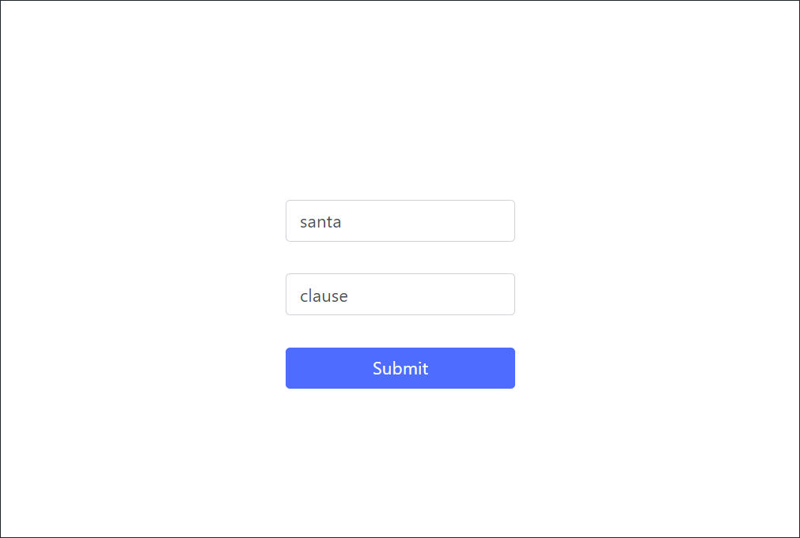
   <br/>
   <p>View and search gifts</p>
   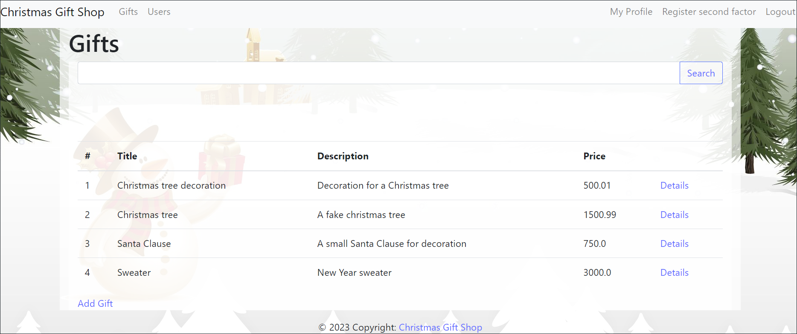
   <br/>
   <p>Page to add a new gift</p>
   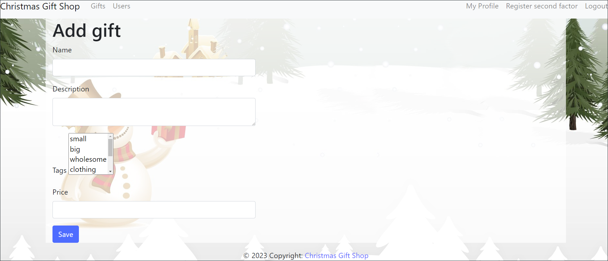
   <br/>
   <p>Details about a gift as well as comments and rating</p>
   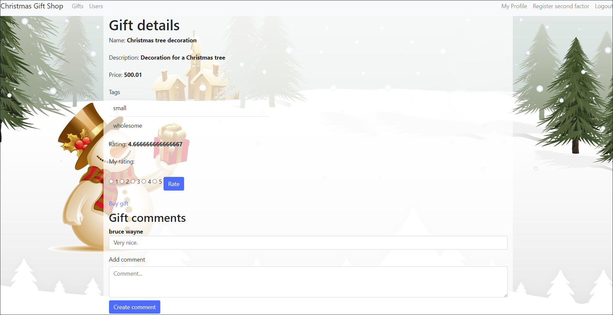
   <br/>
   <p>Users overview</p>
   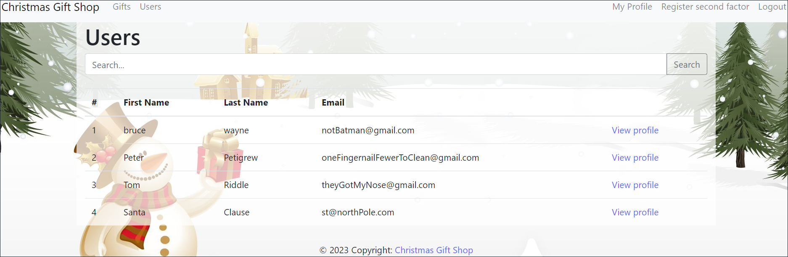
   <br/>
   <p>Details about a user</p>
   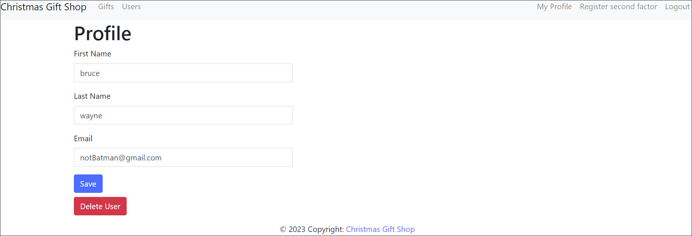
</details>

### Static Code Analysis

The first part of the projects requires us to utilize [SonarQube](https://docs.sonarsource.com/sonarqube/8.9/), a static analysis tool, to generate a comprehensive report identifying vulnerabilities and security hotspots within the project codebase.
[The report](docs/SonarQube%20report.pdf) is attached to the project.

### SQL Injection and Cross-site Scripting (XSS)

The second part of the project requires us to investigate potential XSS and SQL injection vulnerabilities
in the comment form of the Gift Details page. We need to mitigate these vulnerabilities and document attack and defense strategies.

<details>
   <summary style="font-weight: bold">SQLi and XSS attacks demonstration</summary>
   <br/>
   <p>Entering malicious query in the gift comment section</p>
   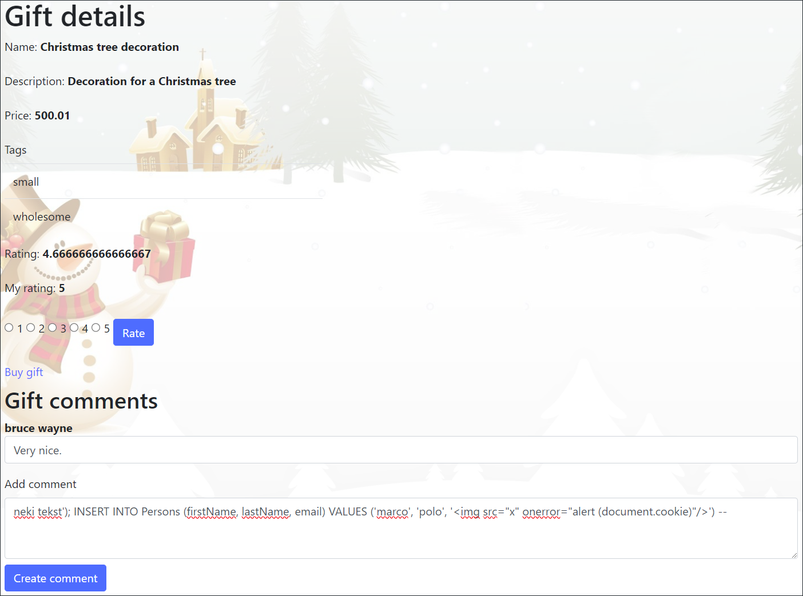
   <br/>
   <p>As a result, a new user has been added into the database, with one of the attributes being an XSS script.</p>
   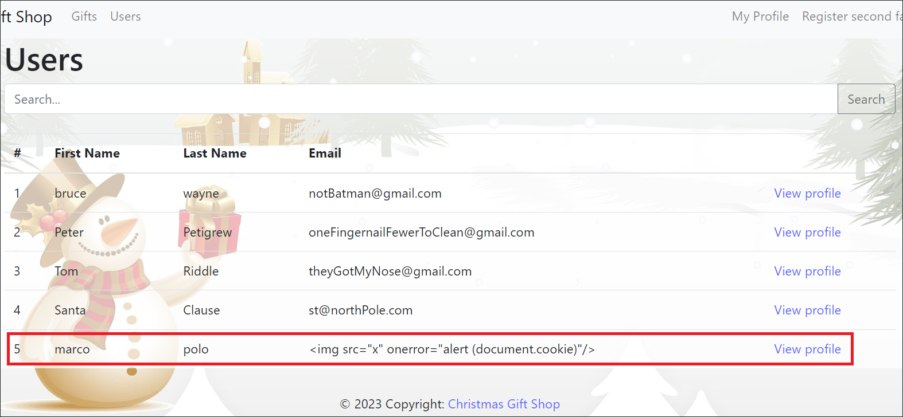
   <br/>
   <p>The XSS script is triggered during user search.</p>
   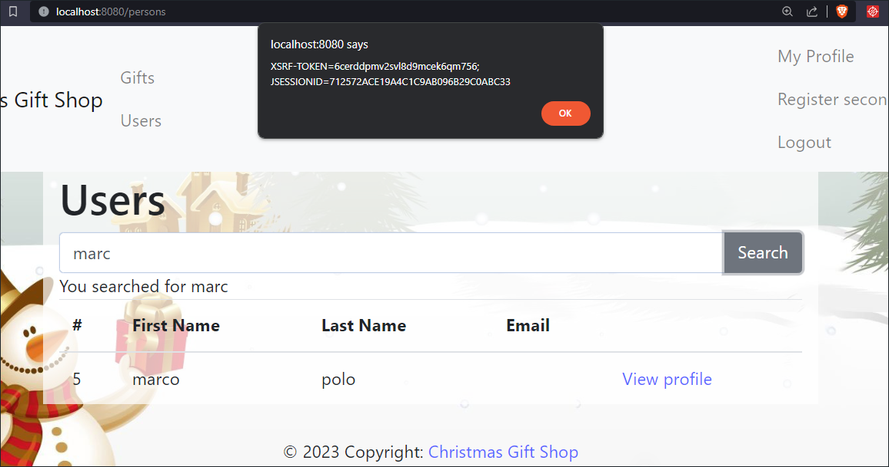
</details>
<details>
   <summary style="font-weight: bold">SQLi and XSS attacks mitigation</summary>
   <br/>
   <p>Mitigating attacks involves employing a parameterized query (PreparedStatement) within the CommentRepository class,
   alongside sanitizing input fields for comments through the introduction of the th:text attribute.
   Additionally, utilizing textContent instead of innerHTML in relevant sections of the persons.html page is crucial to prevent XSS attacks.</p>
</details>

### Cross-site Request Forgery (CSRF)

It is required next to demonstrate a CSRF attack by altering personal data of a user through a crafted script.
Then we have to implement CSRF protection using tokens and document both the attack and defense mechanisms.

<details>
   <summary style="font-weight: bold">CSRF attack demonstration</summary>
   <br/>
   <p>Launching the attacker server on port 3000 ('npm start' command in the 'csrf-exploit' folder)</p>
   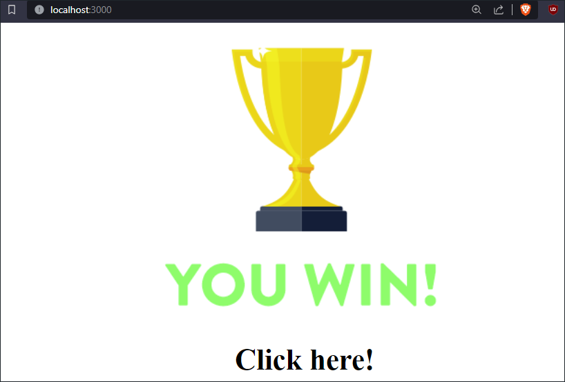
   <br/>
   <p>Clicking on the trophy image triggers a CSRF attack, resulting in a successful HTTP request</p>
   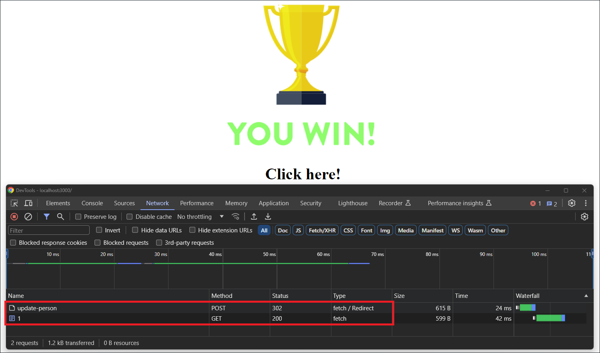
   <br/>
   <p>User with id equal to 1 has modified values for the 'First Name' and 'Last Name' attributes as a result of the successful attack</p>
   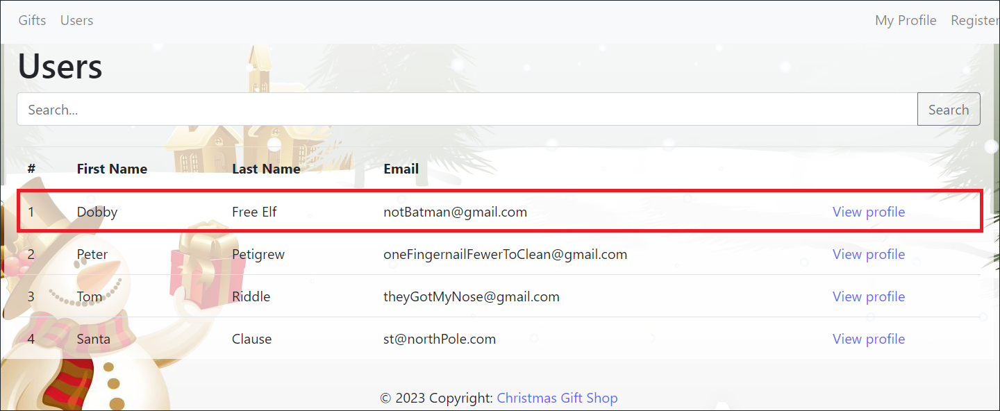
</details>
<details>
   <summary style="font-weight: bold">CSRF attack mitigation</summary>
   <br/>
   <p>It is necessary to implement a mechanism for generating a CSRF token at the session level
   and embedding it into User Details HTML page,
   thereby rejecting unauthorized HTTP requests from the attacker server as they lack the required token.</p>
</details>

### Implementation of Authorization

The project requires us to implement permission matrix as defined in the permissions/roles table (in the project [specification](docs/specification.pdf)).
Then we have to assign roles to users accordingly and ensure proper database configurations.

Creating new roles and associating them with specific users, as well as introducing new permissions, is done in the 'data.sql' file, where the corresponding relationships are inserted into the appropriate tables.

Subsequently, individual permissions are resolved on the frontend by hiding corresponding UI elements for users without permission, or on the backend through appropriate annotations and logical checks during the execution of relevant endpoints.

### DevOps

It is required to implement exception handling and logging mechanisms throughout the application, focusing on the relevance and categorization of log messages.
Then it is necessary to Introduce auditing functionalities to track user actions and ensure the non-repudiation of user actions.

Exception handling is resolved by creating catch branches at appropriate locations, where logging and auditing are performed depending on the operation that triggers the respective exception.
Logging and auditing are also carried out in other relevant parts of the code.

<p align="right">(<a href="#top">back to top</a>)</p>

<!-- GETTING STARTED -->

## Installation

To get a local copy up and running follow these simple steps.
Setup:

1. Clone the repository:
   ```sh
   git clone https://github.com/jovan-vukic/secure-gift-shop-app.git
   ```
2. Build and run the program using your preferred IDE.

<p align="right">(<a href="#top">back to top</a>)</p>

<!-- CONTRIBUTING -->

## Contributing

Contributions are what makes the open source community such an amazing place to learn, inspire, and create. Any
contributions you make are **greatly appreciated**.

If you have a suggestion that would make this better, please fork the repo and create a pull request. You can also
simply open an issue with the tag "enhancement".
Don't forget to give the project a star! Thanks again!

1. Fork the Project
2. Create your Feature Branch (`git checkout -b feature/AmazingFeature`)
3. Commit your Changes (`git commit -m 'Add some AmazingFeature'`)
4. Push to the Branch (`git push origin feature/AmazingFeature`)
5. Open a Pull Request

<p align="right">(<a href="#top">back to top</a>)</p>

<!-- LICENSE -->

## License

Distributed under the MIT License. See `LICENSE` for more information.

<p align="right">(<a href="#top">back to top</a>)</p>

<!-- CONTACT -->

## Contact

Jovan - [@jovan-vukic](https://github.com/jovan-vukic)

Project
Link: [https://github.com/jovan-vukic/secure-gift-shop-app](https://github.com/jovan-vukic/secure-gift-shop-app)

<p align="right">(<a href="#top">back to top</a>)</p>

<!-- ACKNOWLEDGMENTS -->

## Acknowledgments

This project was done as part of the course 'Secure Software Development' (13M111RBS) at the University of
Belgrade, Faculty of Electrical Engineering.

Used resources:

* [The full specification of the project in Serbian language](./docs/specification.pdf)

<p align="right">(<a href="#top">back to top</a>)</p>
